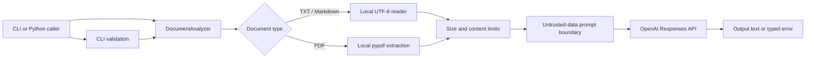

# Architecture

## Overview

OpenAI Document Analyzer is intentionally small. The package separates local
document handling, OpenAI request construction, user interaction, and
compatibility wrappers.

The original file is never uploaded by the package. Extracted text is sent to
the API.

## Package responsibilities

### `analyzer.py`

- validates configuration;
- reads supported files;
- extracts PDF text;
- enforces file and character limits;
- constructs the Responses API request;
- converts expected failures to domain-specific exceptions.

### `cli.py`

- parses CLI arguments;
- reads optional prompt and example files;
- prints results and safe error messages;
- implements the temporary version 1 interactive compatibility mode.

### `exceptions.py`

Defines the stable error hierarchy callers can catch without depending on
OpenAI SDK or PDF parser internals.

### `scripts/`

Contains thin compatibility wrappers. It must not contain a second
implementation. New integrations should import the package or use the installed
console command.

## Trust boundaries

| Boundary | Control |
| --- | --- |
| Local file → parser | Extension allowlist, byte limit, UTF-8 decoding, PDF error handling |
| Extracted text → prompt | Character limit and explicit untrusted-data instruction |
| Application → OpenAI API | Project key, typed request configuration, storage opt-in |
| API response → caller | Empty-output rejection and typed API errors |
| Tests → network | Injected client; no live requests |

Prompt injection is a model-level risk, not a solved parser problem. Downstream
applications must not execute model output or use it for consequential decisions
without authorization and validation.

## Responses API request

Each analysis supplies:

- a selected model;
- stable system instructions;
- one user input containing the request and delimited document data;
- a reasoning-effort setting;
- a text-verbosity setting;
- an output-token limit;
- `store=False` unless the caller opts in;
- an optional privacy-preserving `safety_identifier`.

The package deliberately omits sampling parameters that are not consistently
supported across current reasoning models.

## Extension points

Use constructor injection for:

- custom OpenAI clients;
- timeouts and retry policies;
- observability wrappers;
- test doubles;
- organization-specific transport configuration.

Add a new document type by implementing local extraction, size enforcement,
empty-content handling, tests, and privacy documentation before adding its
suffix to the allowlist.
